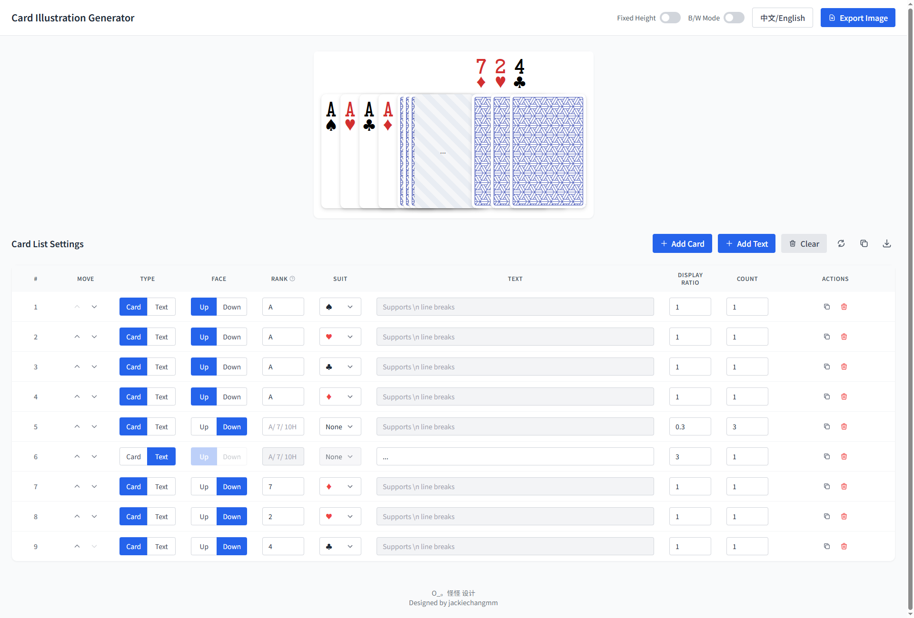

# 纸牌插图生成工具 | Card Illustration Generator

[](https://vuejs.org/)
[](https://www.typescriptlang.org/)
[](https://vitejs.dev/)
[](https://opensource.org/licenses/MIT)

一个现代化的纸牌插图生成工具，帮助用户快速创建专业的纸牌堆叠效果图。支持扑克牌和文本描述卡片，提供实时预览和高质量图片导出功能。



[English](#english) | [中文](#chinese)

## ✨ 功能特性

- 🎴 **双重卡片类型**：支持扑克牌（正面/背面）和文本描述卡
- 🔄 **实时预览**：所见即所得的编辑体验
- 🎨 **视觉效果**：精美的卡片设计和阴影效果
- 🖼️ **高质量导出**：支持 2x 像素密度的 PNG 图片导出
- 🎯 **精确控制**：可调节卡片重叠比例和布局
- 🌓 **黑白模式**：预览灰度打印效果

## 🚀 快速开始

### 环境要求

- Node.js 18+ 
- npm 或 yarn 或 pnpm

### 安装与运行

```bash
# 克隆项目
git clone <repository-url>
cd card-illustration

# 安装依赖
npm install

# 启动开发服务器
npm run dev

# 构建生产版本
npm run build

# 预览构建结果
npm run preview
```

## 📖 使用指南

### 基本操作

1. **添加卡片**：点击"新增牌"按钮添加扑克牌，或"新增描述"添加文本卡片
2. **配置属性**：
   - **类型**：选择"牌"或"描述"
   - **方向**：选择"正面"或"背面"（仅扑克牌）
   - **点数**：输入 A、2-10、J、Q、K（仅扑克牌）
   - **花色**：选择 ♠、♥、♣、♦（仅扑克牌）
   - **文本描述**：输入描述内容（仅文本卡片）
   - **显示比例**：控制下一张卡片的偏移量（0-N）
   - **重复**：设置该配置重复的次数

3. **管理列表**：使用上移、下移、复制、删除按钮调整卡片顺序
4. **导出图片**：点击"导出图片"按钮生成高质量 PNG 图片

### 高级功能

- **数据导入导出**：使用复制/导入按钮备份和恢复配置
- **黑白预览**：切换黑白模式查看灰度效果
- **固定高度**：保持预览区域高度一致
- **外部标签**：背面卡片可显示点数和花色标识

## 🛠️ 技术架构

### 技术栈

- **前端框架**：Vue 3 (Composition API)
- **开发语言**：TypeScript
- **构建工具**：Vite
- **状态管理**：Pinia
- **样式方案**：Tailwind CSS + SCSS
- **图片导出**：html-to-image

### 项目结构

```
src/
├── components/          # Vue 组件
│   ├── AppHeader.vue       # 应用头部
│   ├── CardPreview.vue     # 卡片预览区
│   ├── CardSettings.vue    # 设置面板
│   └── ...
├── stores/              # Pinia 状态管理
│   └── cardStore.ts        # 卡片数据存储
├── types/               # TypeScript 类型定义
│   └── index.ts            # 核心类型接口
├── utils/               # 工具函数
│   └── cardUtils.ts        # 卡片相关工具
└── assets/              # 静态资源
    └── fonts/              # 自定义字体
```

## 🤝 贡献指南

我们欢迎各种形式的贡献！请查看 [CONTRIBUTING.md](CONTRIBUTING.md) 了解详细信息。

### 开发流程

1. Fork 本仓库
2. 创建功能分支：`git checkout -b feature/amazing-feature`
3. 提交更改：`git commit -m 'Add some amazing feature'`
4. 推送分支：`git push origin feature/amazing-feature`
5. 提交 Pull Request

## 📄 许可证

本项目采用 MIT 许可证 - 查看 [LICENSE](LICENSE) 文件了解详情。

## 🙏 致谢

- Vue.js 团队提供的优秀框架
- Tailwind CSS 的现代化样式方案
- html-to-image 库的图片导出功能

---

<a name="english"></a>
## English

A modern card illustration generator that helps users quickly create professional card stack visualizations. Supports both playing cards and text description cards with real-time preview and high-quality image export.

### Features

- 🎴 **Dual Card Types**: Playing cards (front/back) and text description cards
- 🔄 **Real-time Preview**: WYSIWYG editing experience  
- 🎨 **Visual Effects**: Beautiful card design with shadow effects
- 🖼️ **High-quality Export**: 2x pixel density PNG export
- 🎯 **Precise Control**: Adjustable card overlap ratios and layouts
- 🌓 **Grayscale Mode**: Preview grayscale printing effects

### Quick Start

```bash
npm install
npm run dev
```

For detailed documentation, please refer to the Chinese section above.
